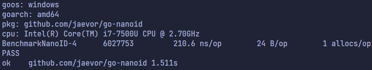

# go-nanoid
 

This module is a Go implementation of [nanoid](https://github.com/ai/nanoid).

Features of the nanoid spec are:
- Use of hardware random generator
- Has larger alphabet than UUID (`A-Za-z0-9_-`), so ID size is reduced from 36 to 21 characters
- Faster than UUID

See [comparison with UUID](https://github.com/ai/nanoid/blob/main/README.md#comparison-with-uuid)

**Read more [here](https://github.com/ai/nanoid/blob/main/README.md)**

---

## Benchmarks
All benchmarks & tests can be found in [nanoid_test.go](./nanoid_test.go).

6,000,000 Nano IDs in 1500ms.

---

## Credits & references
- [Original reference](https://github.com/ai/nanoid)
- [Outdated Go implementation (26/06/22)](https://github.com/matoous/go-nanoid)

---

## License
[MIT LICENSE](./LICENSE)
