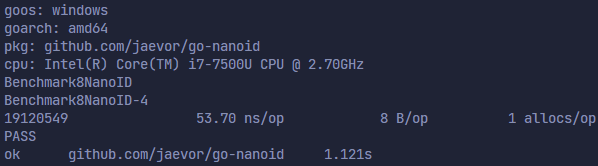
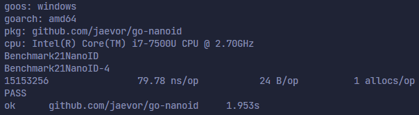
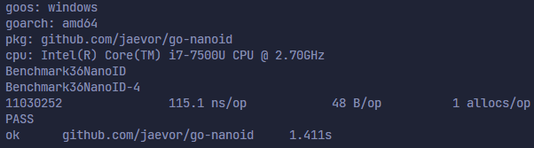
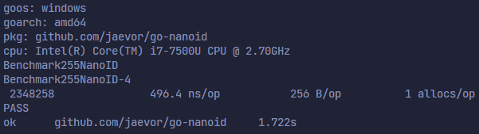

# **go-nanoid**


[](https://github.com/jaevor/go-nanoid/actions)
[](https://github.com/jaevor/go-nanoid/actions)
[](https://github.com/jaevor/go-nanoid/issues)
[](https://github.com/jaevor/go-nanoid/blob/master/go.mod)
[](https://pkg.go.dev/github.com/jaevor/go-nanoid)

[This module](https://pkg.go.dev/github.com/jaevor/go-nanoid) is a Go implementation of [nanoid](https://github.com/ai/nanoid).

Features of the nanoid spec are:

- URL friendly
- Use of hardware random generator
- Uses a bigger alphabet than UUID, so a similar number of random bits are packed in just 21 chars instead of 36 (like UUID)
- Much, much faster than UUID (v4)

Features of this specific implementation are:

- Fastest and most performant implementation of Nano ID around ([benchmarks](#benchmarks))
- Prefetches random bytes in advance
- Uses optimal memory
- No production dependencies
- Semver

## Install

```
go get github.com/jaevor/go-nanoid
```

## Example

```go
import (
	"log"
	"github.com/jaevor/go-nanoid"
)

func main() {
	// The canonic NanoID is nanoid.Standard(21).
	canonicID, err := nanoid.Standard(21)
	if err != nil {
		panic(err)
	}

	id1 := canonicID()
	log.Printf("ID 1: %s", id1) // eLySUP3NTA48paA9mLK3V

	// Makes sense to use CustomASCII since 0-9 is ASCII.
	decenaryID, err := nanoid.CustomASCII("0123456789", 12)
	if err != nil {
		panic(err)
	}

	id2 := decenaryID()
	log.Printf("ID 2: %s", id2) // 817411560404
}
```

# Security

**See [comparison of Nano ID and UUID (V4)](https://github.com/ai/nanoid/blob/main/README.md#comparison-with-uuid):**

> "Nano ID is quite comparable to UUID v4 (random-based). It has a similar number of random bits in the ID (126 in Nano ID and 122 in UUID), so it has a similar collision probability -- **for there to be a one in a billion chance of duplication, 103 trillion version 4 IDs must be generated**"

**And also [NanoID collision calculator](https://zelark.github.io/nano-id-cc/)**:

> If 1,000,000 Nano IDs of length 21 (a.k.a. `nanoid.Standard(21)`) were generated **each second**, it would require ~41 thousand years in order to have a 1% probability of a collision

In other words, with 21 characters, the total number of possible unique IDs would be `21^64`, which is ~four septenvigintillion (`4` followed by `84` zeros) -- a figure larger than the number of atoms that exist in the universe, apparently

**Read more [here](https://github.com/ai/nanoid/blob/main/README.md)**

## Benchmarks

All benchmarks & tests are in [nanoid_test.go](./nanoid_test.go).

These are all benchmarks of `nanoid.Standard(#)`

| # of characters & # of IDs | benchmark screenshot              |
| -------------------------- | --------------------------------- |
| 8, ~21,800,000             |    |
| 21, ~16,400,000            |   |
| 36, ~11,500,000            |   |
| 255, ~2,500,000            |  |

## Notes

I've tried to make non-secure generation of Nano IDs but removed it because I can't figure out a way to generate many random bytes efficiently with PRNGs.

## Credits & references

- [Original reference](https://github.com/ai/nanoid)
- [Older Go implementation of NanoID](https://github.com/matoous/go-nanoid)

## License

[GNU General Public License v3.0](./LICENSE)
